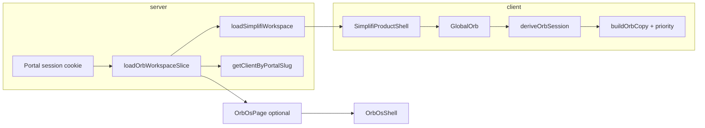

# SIMPLIFI Orb System — Verification

**Date:** 2026-07-16  
**Scope:** `lib/orb`, `GlobalOrb`, `SimplifiProductShell`, workspace shell, experimental `OrbOsShell` (`?chat=1`).

## Architecture (high level)

The orb is a **session context layer** over Simplifi workspace data—not a separate data store.



- **Default UX:** Brief-first workspace at `/simplifi/workspace` with a persistent **GlobalOrb** (floating companion).
- **Experimental UX:** `/simplifi/orb?chat=1` renders **OrbOsShell** (chat-first OS preview); without `chat=1`, redirects to workspace.

## Key files

| Area | Path | Role |
|------|------|------|
| Types & API surface | `lib/orb/types.ts`, `lib/orb/index.ts` | `OrbVisualState`, `OrbBriefSlice`, `OrbSessionInput` / `OrbSessionContext` |
| Data load | `lib/orb/load-context.ts` | `loadOrbWorkspaceSlice(slug)` — brief, objects, action center, firstName |
| State machine | `lib/orb/derive-state.ts` | `deriveOrbSession`, `emptyBriefSlice`, finding/recommendation builders |
| Priority | `lib/orb/priority.ts` | `ORB_STATE_PRIORITY`, `pickHighestOrbState` |
| Copy | `lib/orb/copy.ts` | Route-aware titles, summaries, aria labels |
| Product chrome | `app/simplifi/components/SimplifiProductShell.tsx` | Wraps pages + mounts `GlobalOrb` |
| Global orb UI | `app/simplifi/components/GlobalOrb.tsx` | Drawer, voice/ask, uses `deriveOrbSession` |
| Workspace | `app/simplifi/workspace/SimplifiWorkspace.tsx` | Brief home (parallel `BriefPayload` typing) |
| Orb OS (preview) | `app/simplifi/orb/page.tsx`, `OrbOsShell.tsx` | Chat-first shell; capture / ask / search intents |

## Visual states (`OrbVisualState`)

Derived in `deriveOrbSession` by merging **interaction overrides** (listening / thinking / speaking), **offline**, and an **informational** state from action center + brief + objects:

| State | Typical trigger |
|-------|-----------------|
| `offline` | `online === false` |
| `listening` / `thinking` / `speaking` | Transient interaction |
| `timeSensitive` | Overdue / due-soon language in attention or brief items |
| `opportunity` | Attention + high opportunity score (≥ 70) |
| `recommendation` | Needs attention or high/critical recommended items |
| `discovery` | Watchlist or momentum/explore brief kinds |
| `quiet` | No objects and no attention |
| `idle` | Default when active but not urgent |

Reserved in priority list but not set by current derive path: `success`, `learning`, `celebration`.

Priority order is defined in `lib/orb/priority.ts` (lower index wins).

## Data sources

| Field | Source |
|-------|--------|
| `brief` | `loadSimplifiWorkspace` → greeting, items, `recommendedNext` |
| `objects` | `workspace.activeObjects` (`SimplifiObject[]`) |
| `actionCenter` | `workspace.actionCenter` (`ActionCenterPayload`) |
| `firstName` | Airtable client name via `getClientByPortalSlug` |
| Unauthenticated | `emptyBriefSlice()` + empty action center + no objects |

Client capture flows call existing portal APIs (`/api/portal/captures/analyze`) via `analyzeCaptureUrl` / fetch in `OrbOsShell`.

## TypeScript verification

Command (filtered):

```text
npx tsc --noEmit --pretty false 2>&1 | findstr /i "orb GlobalOrb SimplifiProductShell OrbOsShell load-context derive-state SimplifiWorkspace"
```

**2026-07-16 run — errors found and fixed:**

1. `app/simplifi/orb/OrbOsShell.tsx(118,39)` / `(118,72)` — `data.record.title` on `SimplifiApiResult` default record type `{}`.
2. `app/simplifi/orb/page.tsx(29,7)` — `OrbBriefSlice` not assignable to local `BriefPayload` (`kind` required vs optional).

**Fixes applied (OrbOsShell only):**

- Props use shared `OrbBriefSlice` from `@/lib/orb` (removed duplicate `BriefPayload`).
- URL capture branch casts `data.record` to `{ title?: string } | undefined` before status message.

Re-run after fixes: **no lines matched** the filter (orb-related TS clean).

## Step 0 production QA — 2026-07-16

- Entered the production `demo-client` session and verified `/simplifi/workspace` uses real Brief and Action Center data.
- Verified the resting Orb is fixed in the lower-right, opens a grounded intelligence panel, and persists on `/simplifi/inbox`.
- Verified the phone layout at `390 × 844`: the panel becomes a full-width bottom sheet and the 56px Orb remains inside the viewport.
- Verified `Escape` closes the panel and `prefers-reduced-motion: reduce` removes Orb animation.
- Added focus trapping, background scroll locking, and focus restoration to the modal panel after accessibility QA.
- Added Orb UI smoke coverage and a CI hardening gate for Orb, preview-route, and GlitchTip contracts.

## Remaining gaps

- **Production monitoring:** `/api/health/launch` reports `NEXT_PUBLIC_GLITCHTIP_DSN` missing. No local DSN is available to promote; set it in Vercel Production and redeploy.
- **Type consolidation:** `SimplifiWorkspace` and `CompanionOrb` still define local `BriefPayload` with stricter `kind` unions; align with `OrbBriefSlice` when touching those files.
- **`analyzeCaptureUrl` typing:** Could add a generic `record?: { title?: string }` on `SimplifiApiResult` in `lib/simplifi-client.ts` to avoid casts at call sites.
- **Orb OS route:** Default redirect to workspace; preview gated on `?chat=1` and `orb-preview` API preference — confirm product intent before wide release.
- **States `success` / `learning` / `celebration`:** Listed in priority but not emitted by `deriveOrbSession` yet.

## Suggested manual test plan (local)

1. Log in via portal demo session; open `/simplifi/workspace` — GlobalOrb opens, states shift with mock/real attention data.
2. Navigate capture, calendar, opportunity routes — copy in orb panel matches route (see `buildOrbCopy`).
3. Open `/simplifi/orb?chat=1` — OrbOsShell loads slice; URL capture and note capture update status line.
4. Toggle offline in devtools — orb should move to `offline` state when wired through `GlobalOrb` online listener.

