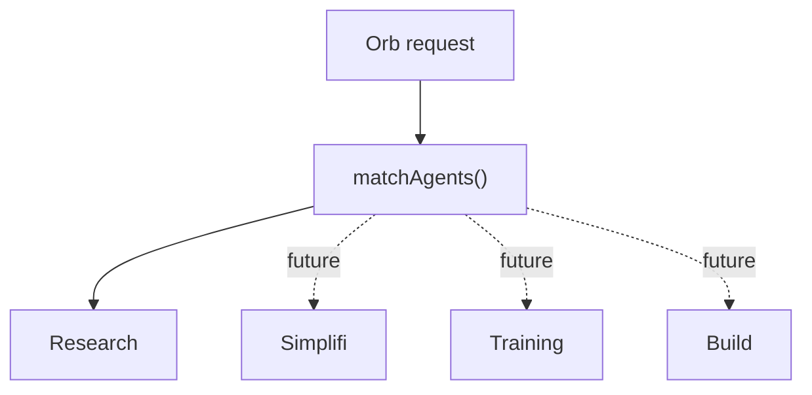

# EA Agent Framework

The EA Agent Framework is the server-side contract behind the Orb.

## Shared Interface

Every production agent implements:

- `name`
- `description`
- `capabilities`
- `permissions`
- `execute()`
- `health()`
- `status()`

The interface lives in `lib/agents/types.ts`.

## Registry Pattern

Agents register once in `lib/agents/registry.ts`. The Orchestrator asks the registry to match agents by requested agent name or capability. This avoids route-level switch statements and keeps future agents isolated.

## Adding A Future Agent

1. Create `lib/agents/new-agent.ts`.
2. Implement `EAAgent`.
3. Register it in `lib/agents/registry.ts`.
4. Add route access only if direct operational testing is needed.
5. Keep user-facing interaction through the Orb and `/api/orchestrator`.

## Error Handling

Agents throw typed or normal errors. Route handlers convert those failures into structured JSON with `ok: false`, a request ID, and a stable error code. The Orchestrator merges successful results and fails only when no selected agent can complete the request.

## Logging And Usage

Gateway and Orchestrator events emit structured JSON logs. Gateway usage tracking records model name, request ID, actor type, and token counts when provider usage is available.
