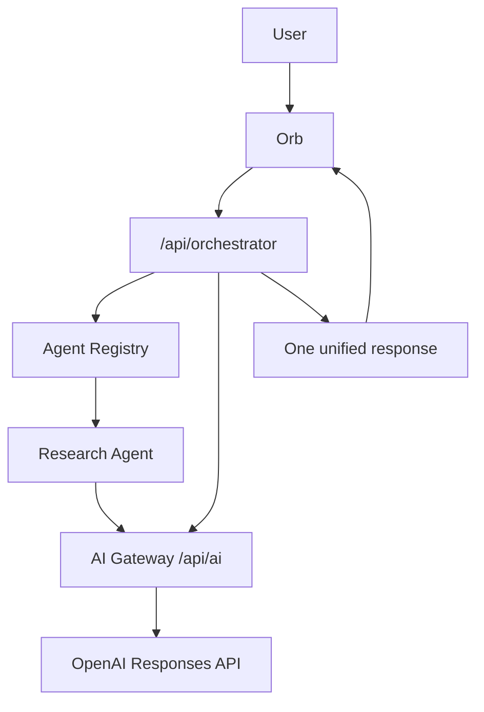
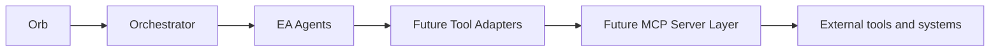

# EA AI Architecture

Sprint 1 introduces the first production layer of the EA Agent Framework. Users continue to interact with one assistant: the Orb. The Orb delegates behind the scenes through the Orchestrator and AI Gateway.

## Request Flow

## Responsibilities

The Orb is the only user-facing assistant. It sends assistant requests to `/api/orchestrator` and does not call individual agents.

The Orchestrator receives Orb requests, selects agents through the registry, calls one or more agents, merges results, and returns one response.

The AI Gateway centralizes provider access, model routing, conversation history, prompt protection, retry handling, rate limiting, request logging, usage tracking, and streaming.

Agents implement a shared interface so Simplifi, Amplifi, Magnifi, Pulse, Training, and Build agents can be added without changing route logic.

## Compatibility

The framework uses the existing Next.js App Router, current admin and portal sessions, Vercel runtime, and existing environment variables. No existing page is required to change its data flow unless it wants AI capabilities.

## Future MCP Layer

MCP is intentionally not implemented in Sprint 1. Agent permissions and execution boundaries are structured so agent tools can later be exposed through an MCP server.
