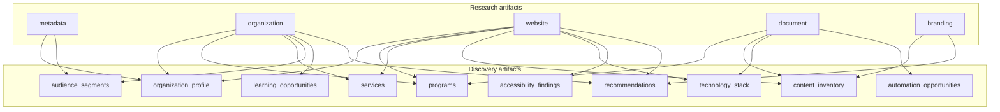
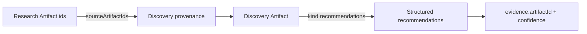
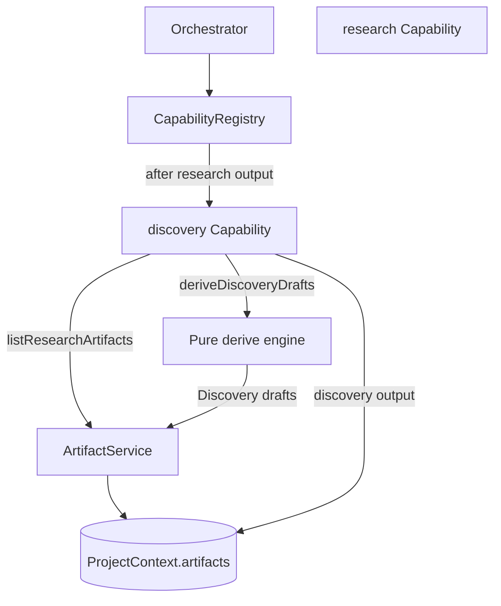

# EA Factory Discovery Capability (Phase 5)

**Status:** Implemented  
**Constraint:** Consumes **Research artifacts only** via ArtifactService. No web requests, external APIs, or AI.  
**Does not implement:** Planning, production, or AI summarization.

---

## Goal

Turn the Research artifact collection into a structured **Discovery** set that later Planning can consume — with explicit **lineage** back to Research artifact ids.

---

## Artifact lineage



Every Discovery artifact provenance includes:

```text
capabilityId: "discovery"
sourceType: "research_artifacts"
sourceArtifactIds: ["artifact-…", …]   // required, non-empty
```



---

## Architecture



### Status flow

```text
… → INTAKE_COMPLETE → RESEARCHING → DISCOVERING
```

Phase 5 terminal: `DISCOVERING` (with discovery output + discovery artifacts present).

---

## Discovery artifact kinds

| Kind | Contents |
|------|----------|
| `organization_profile` | Name, goal, deliverable, industry, primary URL |
| `programs` | Heuristic program signals |
| `services` | Heuristic service / deliverable signals |
| `audience_segments` | Audience keyword / industry segments |
| `content_inventory` | Website, documents, branding entries |
| `technology_stack` | Limited stack from research only (no probing) |
| `learning_opportunities` | Learning-related signals |
| `accessibility_findings` | Metadata-limited findings (no crawl) |
| `automation_opportunities` | Automation candidates |
| `recommendations` | Structured objects with `evidence[]` + `confidence` |

### Recommendation shape

```text
{
  id, title, category, summary, priority,
  confidence: 0..1,
  evidence: [{ artifactId, kind, field, excerpt }]
}
```

---

## Key files

| File | Role |
|------|------|
| [`lib/factory-discovery/derive.mjs`](../../lib/factory-discovery/derive.mjs) | Pure derivation + lineage validation |
| [`lib/factory-capabilities/discovery-capability.ts`](../../lib/factory-capabilities/discovery-capability.ts) | Capability execute |
| [`lib/factory-artifact.mjs`](../../lib/factory-artifact.mjs) / [`.ts`](../../lib/factory-artifact.ts) | Kinds + `listResearchArtifacts` + `sourceArtifactIds` |
| [`lib/factory-capability-gates.mjs`](../../lib/factory-capability-gates.mjs) | `discoveryCanRun` |

---

## Tests

`npm run test:factory-discovery` — derivation, lineage, recommendation confidence/evidence, URL + document integration paths.

---

## Out of scope

- AI summarization
- Production / builders
- Live accessibility audits or tech fingerprinting

Downstream: [planning-capability.md](./planning-capability.md) consumes Discovery artifacts only.

---

*Planning is implemented separately — see planning-capability.md.*
