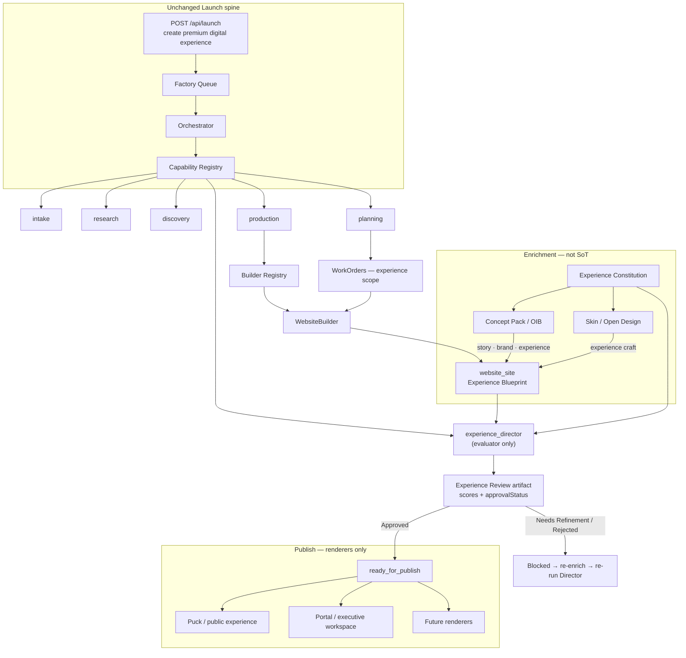

# Experience Blueprint Architecture (Proposal)

**Status:** Awaiting review / approval — **not implemented**  
**Document ID:** ASC-XP-BLUEPRINT-2026-1.0  
**Amendment:** Experience Director capability (ASC-XP-DIRECTOR-2026-1.0)  
**Constitution:** EA Experience Constitution (mandatory) — see below  
**Principle:** One Factory, one Launch pipeline, one Experience Blueprint, one publishing path. Do not fork Launch.

---

## Mandate: language and intent

**Do not ask the Factory to “build a website.”**  
**Ask it to create a premium digital experience.**

| Audience hears | They tend to produce |
|----------------|----------------------|
| “Website” | Components, templates, SaaS layouts |
| “Premium digital experience” | Emotion, pacing, composition, storytelling |

Every prompt, capability note, WorkOrder title, Concept Pack enricher, and renderer brief **must** use experience language. Functional tests are necessary but **not sufficient**. A build is incomplete until the **Experience Director** approves it.

---

## Factory pipeline (with Experience Director)

The EA Factory must not only **generate** experiences — it must **evaluate** them.  
Today’s AI can satisfy requirements. EA must satisfy **craftsmanship**.

```text
Launch
  → Research
  → Discovery
  → Planning
  → Production          (WebsiteBuilder emits Experience Blueprint)
  → Experience Director (evaluates only — never generates, never deploys)
  → Publish             (renders blueprint only when Director status = Approved)
```

| Stage | Role |
|-------|------|
| **Production / WebsiteBuilder** | Produce the Experience Blueprint (structure + story scaffolding + draft `experience`) |
| **Enrichment** (Concept Pack / skin) | Craft into the blueprint — still not SoT for publish |
| **Experience Director** | Creative Director gate — evaluate against Constitution; emit Experience Review artifact |
| **Publish** | Renderer only — allowed **only** when Director status is **Approved** |

**Clarification:** “Experience Blueprint” in the product narrative is the **artifact** produced inside Production (not a separate capability between Planning and Production). The **Experience Director** is the new **capability** inserted before Publish.

---

## Experience Director (Factory capability)

**Capability id:** `experience_director`  
**Manifest order:** `60` (immediately after `production` at `50`)  
**Dependencies:** `['production']`  
**Role:** Evaluator (Creative Director) — **not** a generator, **not** a deployer.

### What it must never do

- Generate websites or experience blueprints  
- Deploy or publish  
- Call builders or mutate page structure as author  
- Fork Launch or replace the Orchestrator  
- Create a parallel review system outside the Factory registry  

### What it must do

1. Load the completed Experience Blueprint from ProjectContext (`website_site` / blueprint v1).  
2. Evaluate it against the **EA Experience Constitution**.  
3. Answer every Experience Review question (below).  
4. Append an **Experience Review** artifact to ProjectContext.  
5. Set Approval Status: `Approved` | `Needs Refinement` | `Rejected`.  
6. Block publish unless status is **Approved**.

It participates in the **same orchestration lifecycle** as every other capability (`canRun` / `execute` / append outputs / never call other capabilities).

### Review dimensions

| Dimension | Evaluates |
|-----------|-----------|
| Storytelling | Who / why / who help / why matters / what changes |
| Visual composition | Custom, premium, intentional, editorial, cinematic |
| User experience | Clarity, flow, invitation without SaaS chrome |
| Emotional impact | Feeling of “built for us” |
| Originality | Swap test + logo-off identity test |
| Layout rhythm | Documentary pacing, section variety, intentional whitespace |
| Typography | Display/body behavior matching `experience.typographyBehavior` |
| Photography direction | Matches `experience.photographyDirection` |
| Motion language | Matches `experience.motionLanguage` |
| Portal experience | Executive workspace, not admin software |
| Overall craftsmanship | Constitution adherence; no forbidden patterns |

---

## EA Experience Constitution (Required)

Mandatory design standard for every public site, landing page, and portal produced by the EA Factory.

### Core principle

We are not building websites.  
We are creating **premium digital experiences** that tell an organization’s story.

The experience should feel custom-designed for this client.  
A visitor should never think: *“This looks like an AI-generated website.”*

### Design philosophy

1. Story before interface.  
2. Emotion before features.  
3. Identity before industry.  
4. Experience before navigation.  
5. Transformation before information.

The **public experience** is the opening chapter.  
The **portal** is the continuation of the story.  
Both must feel like **one continuous experience**.

### Forbidden design patterns

Never generate:

- Box grids as the primary layout  
- Corporate SaaS dashboards  
- Generic card collections  
- Icon grids explaining services  
- “About / Services / Contact” template layouts  
- Cookie-cutter hero sections  
- Equal-height feature cards across the page  
- Large blocks of centered marketing copy  
- Generic AI illustrations  
- Corporate blue gradients  
- Repeated section templates  
- Designs that could belong to any company  

**Swap test:** If a page could be swapped with another company by changing only the logo, the build **fails**.

### Required characteristics

Every experience should feel: editorial · cinematic · magazine quality · human · intentional · premium · calm · memorable · elegant · custom crafted.

### Visual craft reference (level, not imitation)

Match the **craftsmanship** of Apple product storytelling, Stripe Press editorials, Airbnb narrative pages, Patagonia visual storytelling, or Aesop’s restraint.  
Do **not** imitate those brands’ identity.

### Storytelling (homepage)

Every homepage must answer, in order:

1. Who are they?  
2. Why do they exist?  
3. Who do they help?  
4. Why does that matter?  
5. What changes after working with them?  

**Only then** explain services.

### Layout rhythm

The page should unfold like a **documentary**, not a brochure.  
Each section reveals another part of the story.  
Avoid repetitive vertical stacking.  
Create rhythm through changing composition, scale, imagery, typography, whitespace, and motion.

### Portal experience

The portal must **not** feel like an admin application.  
It should feel like an **executive workspace**.  
The client should immediately understand:

- Where they are  
- What has happened  
- What happens next  
- What requires attention  
- What success looks like  

### Experience Review (executed by Experience Director)

A build is **not complete** until the Experience Director answers **every** question below.  
**If any answer is No → publishing is blocked** (status `Needs Refinement` or `Rejected`).

#### Story

Does the homepage clearly explain:

- Who they are?  
- Why they exist?  
- Who they help?  
- Why that matters?  
- What changes after working with them?  

#### Originality

Remove the logo. Remove the company name. Within ten seconds, can someone correctly identify:

- the industry,  
- the audience,  
- the organization’s personality?  

If not → **Reject**.

#### Swap Test

Could this experience belong to another organization by changing only the logo?  
If yes → **Reject**.

#### Visual Craftsmanship

Does the experience feel: custom designed, premium, intentional, editorial, cinematic, memorable?  
Does it avoid: corporate layouts, box grids, SaaS dashboards, repetitive feature cards, generic AI-generated patterns?

#### Story Rhythm

Does the page unfold like a documentary rather than a brochure?  
Does every section advance the story?  
Is there visual variety?  
Is whitespace used intentionally?  
Does composition change throughout the experience?

#### Wow Factor

Will a client likely pause within the first ten seconds and think: *“This was built specifically for us.”*  
If not → **Reject**.

#### Portal Experience

Does the portal feel like an executive workspace instead of administrative software?  
Can a client immediately understand: where they are, what has happened, what happens next, what requires attention, what success looks like?

---

## Problem

The Factory already produces:

```text
Research → Discovery → Planning → Production → website_site
```

Publishing then **ignores** `website_site` and rebuilds from the Concept Pack / OIB. That creates a second source of truth, drifts toward generic SaaS layouts, and blocks additional renderers from sharing one definition. There is also **no Creative Director** capability — functional completion is treated as publish-ready.

---

## Goal

Elevate `website_site` into the **Experience Blueprint**: a technology-agnostic definition of a **premium digital experience** (not a component checklist). Insert **Experience Director** as the Factory capability that evaluates craftsmanship before Publish.

| Role | Responsibility |
|------|----------------|
| **WebsiteBuilder** (Production) | Produce the Experience Blueprint. **Not** a deploy engine. |
| **Concept Pack / enrichers** | Populate story, brand, and **`experience`** — never the publish SoT |
| **Experience Director** | Evaluate blueprint vs Constitution; emit Experience Review; set Approval Status |
| **Publishers / renderers** | Translate blueprint → Puck / portal / future — **only when Approved** |

Leave intact: `POST /api/launch`, queue, orchestrator pattern, ProductionController, WebsiteBuilder registration, existing capabilities. **Extend** the capability registry with `experience_director` only — do not fork Launch or invent a parallel review system.

---

## 1. Proposed Experience Blueprint schema

**Artifact kind remains:** `website_site` (ArtifactService compatibility).  
**Conceptual name:** Experience Blueprint.  
**Canonical payload:** `data` with `schemaVersion` and namespaced sections.

```ts
/**
 * Experience Blueprint — technology-agnostic premium digital experience.
 * artifact.kind === 'website_site'
 * artifact.data === ExperienceBlueprintV1
 */
export type ExperienceBlueprintV1 = {
  schemaVersion: 1;
  kind: 'experience_blueprint';

  meta: {
    workOrderId?: string;
    builderId: 'website';
    projectId?: string;
    /**
     * draft → enriched → under_director_review → ready_for_publish → published
     * ready_for_publish only when Experience Director approvalStatus === 'Approved'
     */
    status:
      | 'draft'
      | 'enriched'
      | 'under_director_review'
      | 'ready_for_publish'
      | 'published'
      | 'needs_refinement'
      | 'rejected';
    enrichedAt?: string;
    reviewedAt?: string;
    publishedAt?: string;
    /** Pointer to Experience Review artifact on ProjectContext — Director is source of approval */
    experienceReviewRef?: string;
    notes?: string[];
  };

  organization: {
    name: string;
    legalName?: string;
    industry?: string;
    primaryUrl?: string;
    tagline?: string;
  };

  story: {
    whoTheyAre?: string;
    whyTheyExist?: string;
    whoTheyHelp?: string;
    whyItMatters?: string;
    whatChanges?: string;
    whatWeLearned?: string[];
    narrative?: string;
    proofPoints?: string[];
  };

  audience: {
    segments: Array<{ id: string; label: string; intent?: string }>;
    primaryPersona?: string;
  };

  brand: {
    primaryColor: string;
    accentColor: string;
    logoUrl?: string;
    typography?: { display?: string; body?: string };
    voice?: string;
    photographyStyle?: string;
  };

  /**
   * Renderer-independent craft definition.
   * Replaces prior `creativeDirection` proposal.
   * EVERY renderer must consume this object.
   */
  experience: {
    emotionalTone: string;
    visualDna: string;
    photographyDirection: string;
    typographyBehavior: string;
    motionLanguage: string;
    spatialRhythm: string;
    lighting: string;
    texture: string;
    interactionStyle: string;
    transitionStyle: string;
    accessibilityGoals: string[];
    brandPersonality: string[];
    /** Explicit constitution adherence */
    constitution: {
      storytellingOrder: 'who_why_who_why_change_then_services';
      forbiddenPatternsAcknowledged: true;
      swapTestRequired: true;
      portalAsExecutiveWorkspace: true;
      continuousPublicAndPortal: true;
    };
    source?: 'concept_pack' | 'skin_brief' | 'open_design' | 'manual' | 'defaults';
    sourceId?: string;
  };

  navigation: {
    primary: Array<{ label: string; href: string }>;
    utility?: Array<{ label: string; href: string }>;
    footer?: Array<{ label: string; href: string }>;
  };

  informationArchitecture: {
    sections: Array<{ id: string; label: string; intent?: string }>;
    principles?: string[];
  };

  pages: Array<{
    id: string;
    path: string;
    title: string;
    order: number;
    /** Documentary beat — what chapter of the story this page/section advances */
    storyBeat?: string;
    seo?: { title?: string; description?: string; ogImageUrl?: string };
    sections: Array<{
      id: string;
      /** Prefer story roles over SaaS roles: opening | identity | people | stakes | transformation | proof | invitation | … */
      role: string;
      label?: string;
      compositionHint?: string;  // scale, whitespace, asymmetry — not "3-column cards"
      copy?: {
        eyebrow?: string;
        headline?: string;
        subhead?: string;
        body?: string;
        bullets?: string[];
      };
      cta?: { label: string; href: string };
      media?: Array<{ id: string; role: string; url?: string; alt?: string }>;
      componentHint?: string;
      animationHint?: string;
      formHint?: { id: string; fields?: string[] };
    }>;
  }>;

  callsToAction: Array<{
    id: string;
    label: string;
    href: string;
    placement?: string;
  }>;

  forms?: Array<{
    id: string;
    purpose: string;
    fields: Array<{ id: string; label: string; type: string; required?: boolean }>;
  }>;

  portal?: {
    modules: Array<{ id: string; label: string; role?: string }>;
    authMode?: string;
    /** Executive workspace framing — not admin chrome */
    workspaceTone?: string;
    memberHome?: {
      persona?: string;
      purpose?: string;
      whereYouAre?: string;
      whatHappened?: string;
      whatNext?: string;
      needsAttention?: string;
      whatSuccessLooksLike?: string;
      tiles?: string[];
    };
  };

  seo?: { siteTitle?: string; defaultDescription?: string };

  assets?: Array<{
    id: string;
    kind: 'image' | 'logo' | 'video' | 'document';
    url?: string;
    alt?: string;
    tags?: string[];
  }>;

  extensions?: Record<string, unknown>;
};
```

### Mapping from today’s `website_site.data`

| Today | Blueprint |
|-------|-----------|
| `organizationName` | `organization.name` |
| `primaryUrl` | `organization.primaryUrl` |
| `pages[]` | `pages[]` (story roles + compositionHint) |
| `navigation` | `navigation` |
| `informationArchitecture` | `informationArchitecture` |
| `workOrderId` / `builderId` | `meta.*` |
| *(new)* | `experience` (required for enrich → review) |
| *(new)* | `story` five-beat answers |
| *(removed from proposal)* | `creativeDirection` → superseded by `experience` |

### Gates

**Structural prerequisites** (before Director can approve):

```text
organization.name
brand.primaryColor + brand.accentColor
experience (required object — not empty defaults-only without enrich)
pages.length >= 1 with opening/hero story beat + headline
story answers: who / why exist / who help / why matters / what changes
```

**Experience Director gate** (required for publish):

```text
ProjectContext has output kind === 'experience_director' (or 'experience_review')
Approval Status === 'Approved'
All mandatory review answers === Yes
```

Blueprint `meta.status` may only become `ready_for_publish` when the Director has **Approved**.  
Renderers **must refuse** to publish when status is `draft`, `enriched`, `Needs Refinement`, or `Rejected` — or when no Approved Experience Review artifact exists.

---

## Experience Review artifact (Director output)

Appended to ProjectContext by `experience_director.execute` — never overwrites history.

```ts
type ExperienceReviewArtifact = {
  kind: 'experience_review';           // capability output kind may be 'experience_director'
  schemaVersion: 1;
  projectId: string;
  blueprintRef: string;                // website_site / blueprint artifact id
  evaluatedAt: string;

  scores: {
    overall: number;                   // 0–100
    story: number;
    visual: number;
    originality: number;
    executiveExperience: number;       // portal / continuous experience
    wow: number;
  };

  answers: {
    story: boolean;
    originality: boolean;
    swapTest: boolean;                 // true = passes (does NOT belong to another org)
    visualCraftsmanship: boolean;
    storyRhythm: boolean;
    wowFactor: boolean;
    portalExperience: boolean;
  };

  requiredImprovements: string[];      // empty when Approved
  notes?: string;

  /** Publishing allowed ONLY when status === 'Approved' */
  approvalStatus: 'Approved' | 'Needs Refinement' | 'Rejected';
};
```

| Status | Meaning | Publish? |
|--------|---------|----------|
| **Approved** | Meets Constitution; craftsmanship bar cleared | **Yes** |
| **Needs Refinement** | Recoverable gaps; re-enrich then re-run Director | No |
| **Rejected** | Fails originality, swap test, or wow — redesign required | No |

On `Needs Refinement` / `Rejected`: re-enrich (or regenerate scaffolding) → append new blueprint snapshot → Director runs again. Provenance is preserved (append-only ProjectContext).

---

## 2. Architecture diagram



**Rules:**

1. One Factory — Director is a registry capability, not a side system.  
2. Blueprint remains the single source of truth.  
3. Director **evaluates**; Publish **renders**.  
4. No publish unless `approvalStatus === 'Approved'`.

---

## 3. Minimal code changes

| # | Change | Purpose |
|---|--------|---------|
| 1 | `ExperienceBlueprintV1` + Constitution constants | Contract |
| 2 | WebsiteBuilder emits v1 blueprint | Produce blueprint |
| 3 | Enricher merges Concept Pack → `story`, `brand`, **`experience`** | Premium craft |
| 4 | Manifest + registry: `experience_director` (order 60, depends on `production`) | Capability |
| 5 | `ExperienceDirectorCapability` — evaluate → append Experience Review artifact | Gate |
| 6 | `publishFactoryWebsite` reads blueprint **and** requires Approved review | Renderer gate |
| 7 | Prompt/copy audit: “premium digital experience” language | Language |
| 8 | Contract tests: no pack-as-SoT; no publish without Approved; Director never deploys | Safety |

**Non-changes:** Launch route, queue, orchestrator pattern, ProductionController dispatch, WebsiteBuilder no-deploy rule. **Do not** fork Launch or replace the orchestrator.

---

## 4. Files that will change

| File | Change |
|------|--------|
| `docs/architecture/experience-blueprint.md` | This proposal |
| `docs/architecture/capability-manifest.md` | Document `experience_director` (proposed → then implemented) |
| `lib/factory-capability-manifest.mjs` | Add `experience_director` order 60 |
| `lib/factory-capabilities/experience-director-capability.ts` (**new**) | Evaluator capability |
| `lib/factory-experience-blueprint.ts` (**new**) | Schema, enrich merge |
| `lib/factory-experience-constitution.ts` (**new**, optional split) | Constitution + review questions as data |
| `lib/factory-experience-review.ts` (**new**, optional) | Scoring / answer helpers for Director |
| `lib/factory-builders/website-builder.mjs` | Emit blueprint v1 |
| `lib/factory-capability-registry` bootstrap | Register Director |
| `lib/factory-concept-pack.ts` / `factory-notify.ts` | Enrich into blueprint |
| `lib/factory-publish-website.ts` | Blueprint renderer + Approved gate |
| `lib/provision-website-portal.ts` | Experience-driven composition |
| `lib/factory-client-package.ts` | Prefer blueprint |
| Factory UI copy | “Premium digital experience” language |
| Tests + related architecture docs | Pipeline + Director |

---

## 5. Migration requirements

| Case | Behavior |
|------|----------|
| New projects | Blueprint → enrich → Director → publish only if Approved |
| Legacy `website_site` | Normalize; `draft` until enrich + Director run |
| Publish without Approved review | **Hard fail** |
| Needs Refinement / Rejected | Re-enrich → new blueprint snapshot → Director again |
| Existing production-complete projects | Director becomes next runnable capability (no Launch fork) |

---

## 6. Risks

| Risk | Mitigation |
|------|------------|
| Review becomes checkbox theater | Scores + narrative `requiredImprovements`; optional human sign-off for first clients |
| Director invents content | Capability contract: evaluate-only; no builder calls |
| Parallel review system creeps in | Single capability in registry; publish reads only its artifact |
| Enricher still emits SaaS layouts | Constitution in prompt + Director rejects + renderer refuses feature grids |
| `experience` too vague for Puck | Map fields to concrete renderer rules |
| Naming: artifact still `website_site` | Docs + `data.kind: 'experience_blueprint'` + UI copy |

---

## 7. Why this is superior

| Current | Proposed |
|---------|----------|
| “Build a website” → components | “Create a premium digital experience” → craft |
| Concept Pack is publish SoT | Blueprint is SoT; pack enriches |
| No shared craft object | **`experience`** required by every renderer |
| Functional pass = done | **Experience Director** required — studio Creative Director |
| Easy to drift to generic SaaS | Constitution + swap/originality/wow tests + Approved-only publish |
| Ad-hoc checklists | One Factory capability, same orchestration lifecycle |

---

## Approval checklist

- [ ] Approve Experience Constitution as mandatory  
- [ ] Approve language: “premium digital experience” (not “build a website”)  
- [ ] Approve schema v1 with **`experience`** (not `creativeDirection`)  
- [ ] Approve **Experience Director** as Factory capability (order 60, after Production, before Publish)  
- [ ] Approve Experience Review artifact (scores + `Approved` / `Needs Refinement` / `Rejected`)  
- [ ] Approve: publish **only** when status is **Approved**  
- [ ] Approve keep artifact kind `website_site`  
- [ ] Approve Concept Pack as enrich-only  
- [ ] Approve: no Launch fork, no parallel review system, no orchestrator replacement  
- [ ] Approve Phase 1: public home from blueprint + portal continuity later  

**Do not implement until this amended proposal is approved.**
