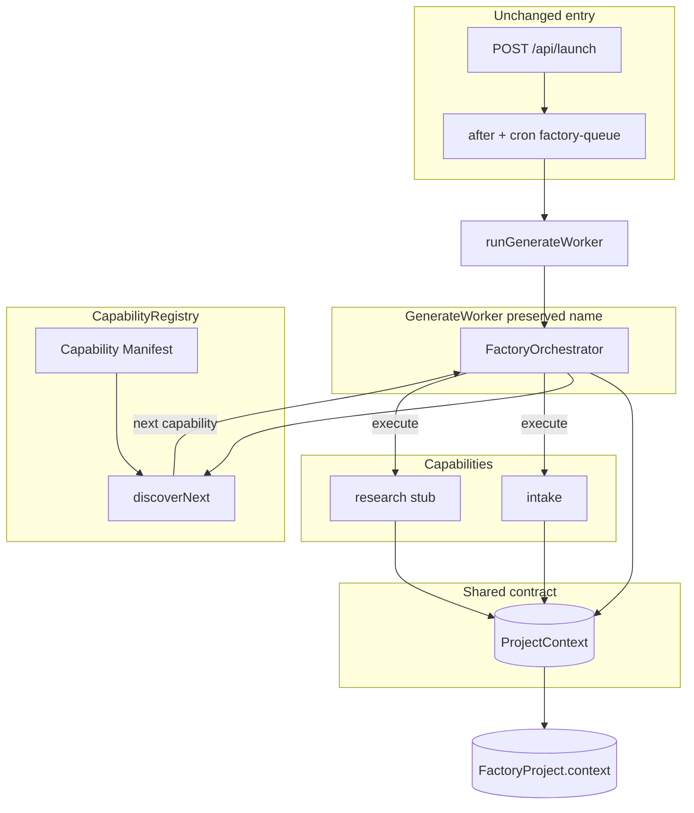
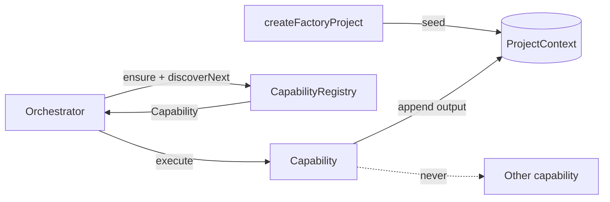
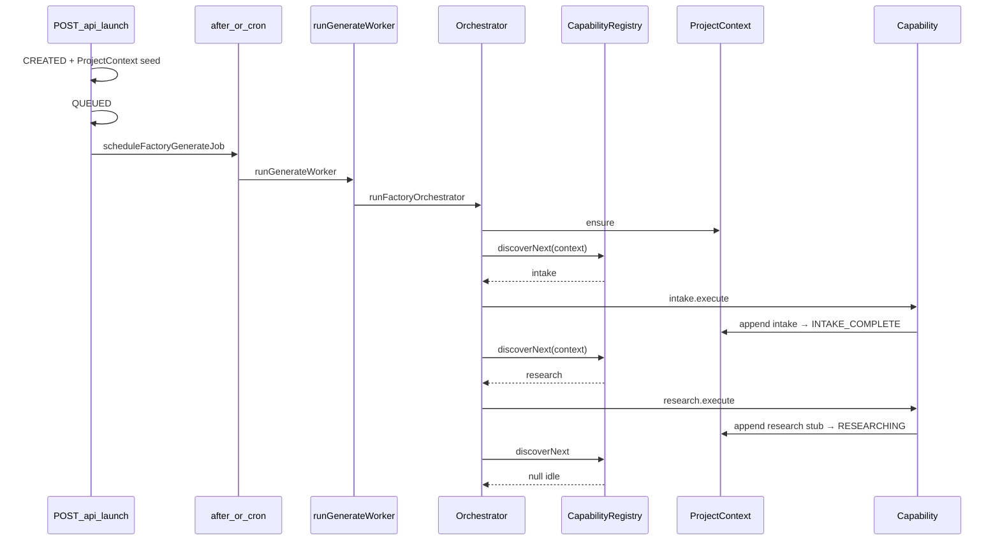

# EA Factory Orchestrator + ProjectContext + CapabilityRegistry

**Status:** Phase 3 implemented  
**Constraint:** Public APIs unchanged (`POST /api/launch`, project IDs, auth).  
**Manifest:** [capability-manifest.md](./capability-manifest.md)  
**Predecessor:** [current-state.md](./current-state.md) (Phase 1 baseline).

---

## Goal

**GenerateWorker** remains the scheduled entry name. Its body is an **Orchestrator** that:

1. Ensures **ProjectContext**
2. Discovers the next **Capability** from the **CapabilityRegistry** (manifest order + dependencies + `canRun`)
3. Dispatches `execute(ProjectContext)` once per step

Capabilities never call each other. Phases 4–7 are artifact-based; see research/discovery/planning docs and [production-framework.md](./production-framework.md).

---

## Long-term execution contract: ProjectContext

| Field | Role |
|-------|------|
| `schemaVersion` | Evolution gate (currently `1`) |
| `projectId` | Stable project identity |
| `seed` | Immutable launch snapshot |
| `pipelineStatus` | Current pipeline status (synced with project row) |
| `outputs[]` | Append-only structured capability results |
| `createdAt` / `updatedAt` | Lifecycle timestamps |

### Rules

1. Capabilities read **ProjectContext** — not arbitrary project fields for business decisions.
2. Capabilities **append** outputs — never overwrite prior history (idempotent by `id`).
3. **Only the Orchestrator** schedules/dispatches.
4. Capabilities **never call one another.**
5. `schemaVersion` supports migrate-on-read.
6. Compat: latest intake mirrored to `project.intake`.

---

## Capability interface (Phase 3)

```text
Capability {
  id: string
  dependencies: string[]
  canRun(ProjectContext): boolean
  execute(ProjectContext): Promise<CapabilityExecutionResult>
}
```

| API | Role |
|-----|------|
| `register(capability)` | Add/replace a capability on the registry |
| `get(id)` / `list()` | Discovery of registered capabilities |
| `discoverNext(context)` | First runnable capability by manifest order |

See [capability-manifest.md](./capability-manifest.md) for order and dependencies.

---

## Architecture



### Data flow



### Principles

- Orchestrator does **not** call `createEACPLaunch` on the default path.
- Legacy package path: `runLegacyGeneratePackageWorker` (not default).
- Dispatch is **registry-driven**, not a fixed if/else sequence.
- Worker adapter files (`intake-worker.ts`, `research-worker.ts`) remain thin wrappers for compat.

---

## Status flow (unchanged behavior)

```text
CREATED → QUEUED → INTAKE → INTAKE_COMPLETE → RESEARCHING → DISCOVERING → PLANNING → BUILDING
                         ↘ FAILED
```

| Status | Capability |
|--------|------------|
| `QUEUED` / `INTAKE` | `intake` |
| `INTAKE_COMPLETE` | `research` |
| `RESEARCHING` | `discovery` |
| `DISCOVERING` | `planning` |
| `PLANNING` | `production` (WebsiteBuilder) |
| `BUILDING` | Phase 7 terminal after website WorkOrder complete |

---

## Sequence diagram



---

## Key files

| File | Role |
|------|------|
| [`lib/factory-capability.ts`](../../lib/factory-capability.ts) | Capability interface + registry helpers |
| [`lib/factory-capability-registry.mjs`](../../lib/factory-capability-registry.mjs) | Pure register / discover |
| [`lib/factory-capability-manifest.mjs`](../../lib/factory-capability-manifest.mjs) | Order + dependencies |
| [`lib/factory-capability-gates.mjs`](../../lib/factory-capability-gates.mjs) | Pure `canRun` gates |
| [`lib/factory-capabilities/`](../../lib/factory-capabilities/) | Intake + Research implementations |
| [`lib/factory-orchestrator.ts`](../../lib/factory-orchestrator.ts) | Sole dispatcher via registry |
| [`lib/factory-project-context.ts`](../../lib/factory-project-context.ts) | Shared ProjectContext service |
| [`lib/factory-workers/intake-worker.ts`](../../lib/factory-workers/intake-worker.ts) | Thin adapter |
| [`lib/factory-workers/research-worker.ts`](../../lib/factory-workers/research-worker.ts) | Thin adapter |

**Unchanged:** `app/api/launch/route.ts`, project ID format, auth, OpenAPI path shapes.

---

## Tests

| Command | Coverage |
|---------|----------|
| `npm run test:factory-capability-registry` | Registry/manifest/gates + in-memory integration dispatch |
| `npm run test:factory-project-context` | ProjectContext lifecycle |
| `npm run test:factory-orchestrator` | Intake classify + wiring contracts |
| `npm run verify:factory-launch` | Live smoke → `RESEARCHING` + intake |

---

## Backward compatibility

| Concern | Behavior |
|---------|----------|
| `POST /api/launch` | Unchanged |
| Project IDs | `proj-{time}-{hex}` |
| `runGenerateWorker` | Still the scheduled entry |
| Pipeline statuses | Same Phase 2 path to `RESEARCHING` |
| `runIntakeWorker` / `runResearchWorker` | Thin capability adapters retained |

---

## Next phase (not started)

- Real research (crawl) — still a Capability appending research outputs
- Register discovery / planning / builders via manifest + registry
- No public API changes required to add capabilities

---

*Stop here for review before implementing Research crawling or later capabilities.*
