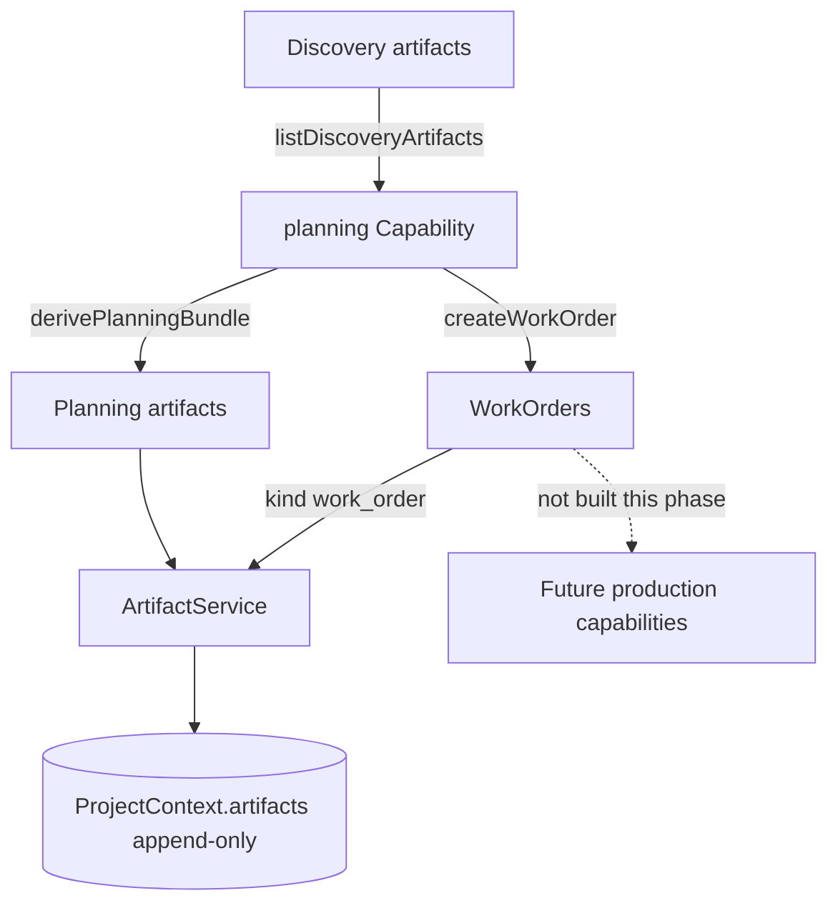
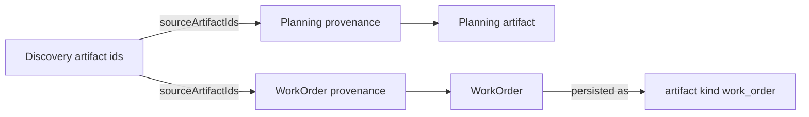

# EA Factory Planning Capability (Phase 6)

**Status:** Implemented  
**Constraint:** Consumes **Discovery artifacts only**. No external requests. No AI. No production builders.  
**Unchanged:** Launcher, Orchestrator, Capability Registry mechanics, ProjectContext schema.

---

## Goal

Turn Discovery artifacts into a structured **Planning** pack and emit **WorkOrders** for later production capabilities — with provenance lineage back to Discovery artifact ids.

---

## Planning + WorkOrder flow





---

## Planning artifact kinds

| Kind | Role |
|------|------|
| `executive_summary` | Org/goal/deliverable summary |
| `information_architecture` | Site/portal IA sections |
| `website_sitemap` | Path nodes |
| `navigation_tree` | Primary/utility/footer nav |
| `portal_blueprint` | Portal modules + auth note |
| `learning_architecture` | Learning tracks |
| `content_strategy` | Pillars + inventory reuse |
| `deliverables_matrix` | Deliverable × owner matrix |
| `production_plan` | Phased production plan (advisory) |
| `milestone_plan` | Ordered milestones |
| `review_checklist` | Human review gates |
| `work_order` | Carrier artifact for WorkOrder model |

---

## WorkOrder model

```text
WorkOrder {
  id, projectId, type, title, summary,
  priority, status, deliverable,
  acceptanceCriteria[], dependencies[],
  provenance.sourceArtifactIds[]  // Discovery ids (required)
  payload
}
```

Types used now: `website`, `portal`, `learning`, `content`, `accessibility`, `qa`, (+ `automation` when discovery has automation opportunities).

WorkOrders are **ready** for downstream production but **not executed** in Phase 6.

---

## Status flow

```text
… → RESEARCHING → DISCOVERING → PLANNING
```

Phase 6 terminal: `PLANNING` (planning output + planning artifacts + work_order artifacts).

Dispatch uses existing Orchestrator `discoverNext` + Capability Registry registration (registry/orchestrator codepaths unchanged).

---

## Key files

| File | Role |
|------|------|
| [`lib/factory-planning/derive.mjs`](../../lib/factory-planning/derive.mjs) | Pure planning + WorkOrder derivation |
| [`lib/factory-work-order.mjs`](../../lib/factory-work-order.mjs) / [`.ts`](../../lib/factory-work-order.ts) | WorkOrder model |
| [`lib/factory-capabilities/planning-capability.ts`](../../lib/factory-capabilities/planning-capability.ts) | Capability execute |
| [`lib/factory-artifact.ts`](../../lib/factory-artifact.ts) | `listPlanningArtifacts`, `listWorkOrders`, `appendWorkOrders`, `provenanceFromDiscoveryArtifacts` |

---

## Tests

`npm run test:factory-planning`

---

## Out of scope (Planning phase)

- AI generation
- Changing Launcher / Orchestrator / Registry / ProjectContext

Downstream: [production-framework.md](./production-framework.md) (WebsiteBuilder first).

---

*Production builders are implemented separately — see production-framework.md.*
