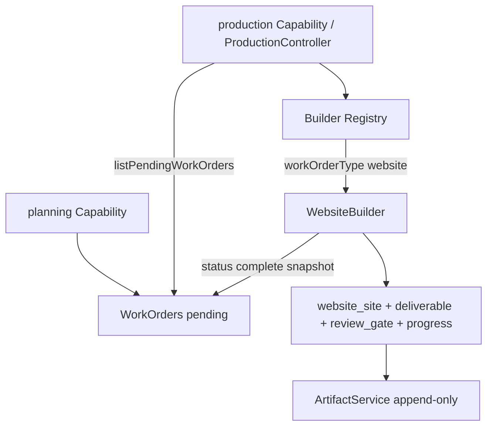
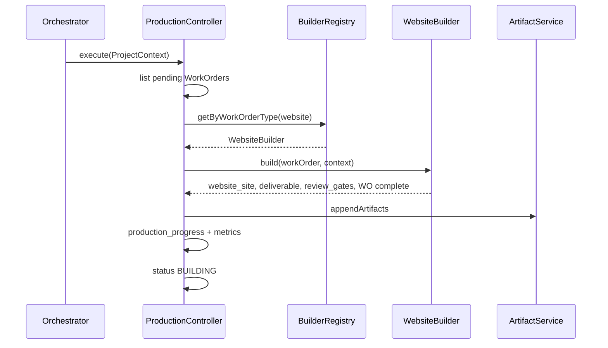

# EA Factory Production Framework (Phase 7)

**Status:** Implemented (WebsiteBuilder only)  
**Constraint:** Preserve Launcher, Orchestrator, Capability Registry mechanics, ProjectContext, ArtifactService APIs, and WorkOrder contracts.  
**Not in this phase:** Portal, Learning, or Report builders.

---

## Goal

Introduce a **ProductionController** that reads pending **WorkOrders** and dispatches **builders** through a **Builder Registry**. First builder: **WebsiteBuilder**.

---

## Flow





---

## Components

| Component | Role |
|-----------|------|
| **ProductionController** (`production` capability) | Sole production dispatcher via Builder Registry |
| **Builder Registry** | `register` / `getByWorkOrderType` — separate from Capability Registry |
| **WebsiteBuilder** | website WorkOrders → `website_site` artifacts |
| **Deliverable** | Production deliverable model (`deliverable` artifact) |
| **Review Gates** | Pending human/system gates (`review_gate` artifacts) |
| **Production progress** | Metrics snapshot (`production_progress` artifact) |

---

## WebsiteBuilder

- Consumes **website** WorkOrders only
- Reads planning artifacts (sitemap, navigation, IA, executive summary) from context
- Produces:
  - `website_site` artifact (structured pages)
  - `deliverable` (type website, `ready_for_review`)
  - review gates: `website-content`, `website-navigation` (pending)
  - WorkOrder **complete** snapshot (append-only; same WorkOrder id, new artifact id)
- No deploy / no external requests / no AI

---

## WorkOrder completion (append-only)

WorkOrder contract preserved:

- Planning provenance (`capabilityId: planning`, `sourceArtifactIds`) retained
- Completion appends a new `work_order` artifact with `status: complete`
- `listWorkOrdersFromArtifacts` returns **latest snapshot per WorkOrder id**

---

## Progress metrics (logged + persisted)

```text
workOrdersTotal / InScope / Complete / Pending
buildersRun
websiteArtifactsCreated
deliverablesCreated
reviewGatesCreated / Pending
percentComplete
```

Log prefix: `[factory-production]` (+ builder dispatch lines).

---

## Status

```text
… → PLANNING → BUILDING
```

Phase 7 terminal for WebsiteBuilder: `BUILDING` with website WorkOrder complete; other WorkOrders may remain pending (no builder yet).

---

## Key files

| File | Role |
|------|------|
| [`lib/factory-capabilities/production-capability.ts`](../../lib/factory-capabilities/production-capability.ts) | ProductionController |
| [`lib/factory-builder-registry.mjs`](../../lib/factory-builder-registry.mjs) | Builder Registry |
| [`lib/factory-builders/website-builder.mjs`](../../lib/factory-builders/website-builder.mjs) | WebsiteBuilder |
| [`lib/factory-deliverable.mjs`](../../lib/factory-deliverable.mjs) | Deliverable model |
| [`lib/factory-review-gate.mjs`](../../lib/factory-review-gate.mjs) | Review Gates |
| [`lib/factory-production-progress.mjs`](../../lib/factory-production-progress.mjs) | Progress + metrics |

---

## Tests

`npm run test:factory-production`

---

## Out of scope

- PortalBuilder / LearningBuilder / ReportBuilder
- Publishing / live deploy
- AI generation

---

*Stop here for review before additional builders.*
