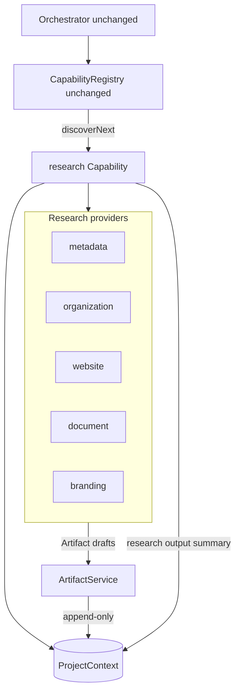

# EA Factory Research Capability (Phase 4)

**Status:** Implemented  
**Constraint:** Orchestrator + Capability Registry dispatch mechanics unchanged.  
**No AI** summarization or planning in this phase.

---

## Goal

Turn intake (URL, organization name, and/or documents) into a **structured, append-only collection of research Artifacts** that later capabilities can consume.

---

## Architecture

### Data flow

1. Orchestrator discovers `research` when ProjectContext is `INTAKE_COMPLETE` and intake output exists.
2. Research Capability runs each provider that `canCollect(context)`.
3. Providers emit **Artifact drafts** (never call each other).
4. **ArtifactService** appends artifacts onto `ProjectContext.artifacts[]` with provenance.
5. Research appends a `kind: 'research'` output summarizing `artifactIds` + provider runs.
6. Status → `RESEARCHING`.

---

## Artifact model

| Field | Role |
|-------|------|
| `schemaVersion` | Artifact schema (currently `1`) |
| `id` | Stable artifact id |
| `projectId` | Owning project |
| `kind` | `website` \| `organization` \| `document` \| `branding` \| `metadata` |
| `providerId` | Provider that produced it |
| `provenance` | `capabilityId`, `sourceType`, `sourceUrl`, `intakeOutputId`, `seedClient`, `collectedAt`, … |
| `data` | Structured provider payload (no AI prose) |

Artifacts are **append-only** and idempotent by `id`.

ProjectContext **schemaVersion 2** adds `artifacts[]` (migrate-on-read from v1).

---

## Providers

| Provider | When | Emits |
|----------|------|--------|
| `metadata` | always | Launch/intake metadata snapshot |
| `organization` | always | Org name, goal, industry, notes, primary URL |
| `website` | seed/intake URL present | HTTP fetch + HTML title/meta/og extraction (no AI) |
| `document` | document attachments/sources | Attachment metadata + textPreview when present |
| `branding` | always (images/URL/name) | Image assets, favicon guess, brand name signals |

Website fetch failures still produce a website artifact with `ok: false` and error provenance — so downstream always sees an attempt record.

---

## Key files

| File | Role |
|------|------|
| [`lib/factory-artifact.mjs`](../../lib/factory-artifact.mjs) / [`.ts`](../../lib/factory-artifact.ts) | Artifact model + ArtifactService |
| [`lib/factory-research/providers.mjs`](../../lib/factory-research/providers.mjs) | Pure provider planners |
| [`lib/factory-research/*-provider.ts`](../../lib/factory-research/) | Provider implementations |
| [`lib/factory-research/run-providers.ts`](../../lib/factory-research/run-providers.ts) | Provider runner |
| [`lib/factory-capabilities/research-capability.ts`](../../lib/factory-capabilities/research-capability.ts) | Capability `execute` |
| [`lib/factory-project-context.mjs`](../../lib/factory-project-context.mjs) | Context v2 + `artifacts[]` |

**Unchanged:** `lib/factory-orchestrator.ts`, `lib/factory-capability-registry.mjs`, `POST /api/launch`.

---

## Logging

Prefixes:

- `[factory-research]`
- `[factory-research:metadata|organization|website|document|branding]`
- `[factory-artifact]`

---

## Tests

`npm run test:factory-research` — artifact lifecycle, HTML extract, provider plans, URL/document integration (mocked website fetch data).

---

## Out of scope (later)

- AI summarization / synthesis
- Deep document binary parsing
- Firecrawl-only dependency (optional enhancement later)

Downstream: [discovery-capability.md](./discovery-capability.md) consumes Research artifacts only.

