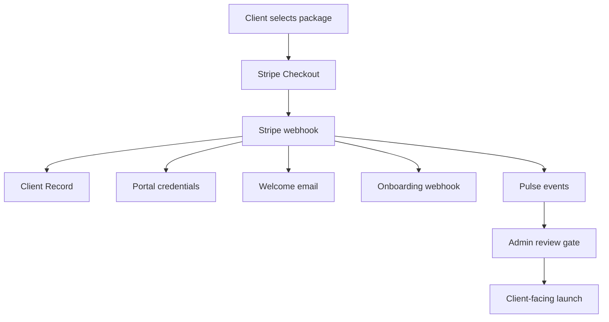

# Productized Package Automation

Landing Page, Client Portal, and Connect Profile are now first-class purchasable EA packages.

## Purchase Links

- Connect Profile: `/checkout?package=connect_profile`
- Landing Page: `/checkout?package=landing_page`
- Client Portal: `/checkout?package=client_portal`

## Flow

## Production Rule

Selling and onboarding are automated. Client-facing launch remains review-gated.

That means the system can take payment, create records, provision access, notify the client, notify EA, and queue the right fulfillment path. The final publish/go-live step still requires review.

## Readiness Check

Use `/api/health/package-fulfillment` to confirm:

- The three productized packages are purchasable.
- Checkout paths exist.
- Fulfillment plans resolve.
- Required production services are configured.
